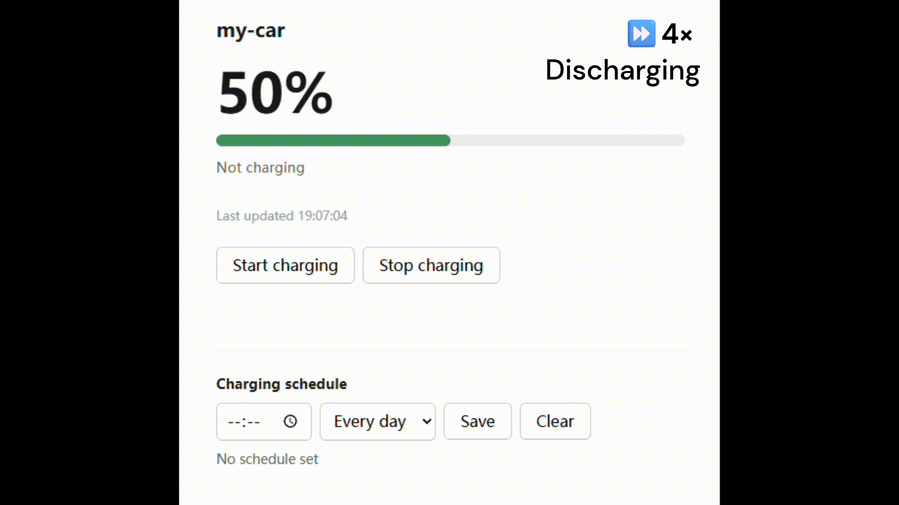
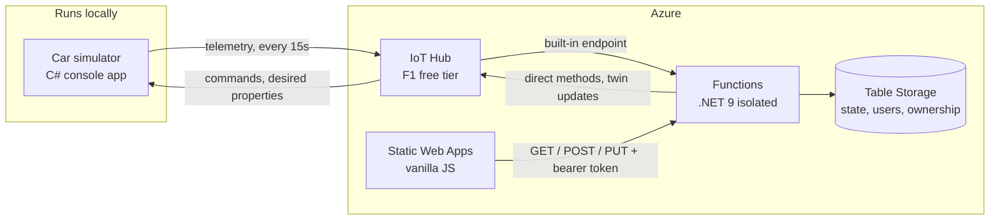

# EV Charging Dashboard

A web dashboard for car owners: sign in, see the battery level, start and stop charging remotely, and set a daily charging schedule. The car is a simulated IoT device connected through Azure IoT Hub.

**[Live demo](https://blue-bush-0e25f2c00.5.azurestaticapps.net)** — the dashboard is deployed to Azure. The car simulator runs locally, so start it first (see [Quick start](#quick-start)) or the page will show the last state the car reported.



---

## Architecture



The car never exposes an address the browser could reach, so every interaction goes through IoT Hub. That constraint shapes the whole design.

**The car and the charging station are modelled as a single device.** In reality these are usually two systems and they exchange a limited set of values over the charging cable. For simplification, this implementation puts both the battery reading and the charging control on one device **Car Simulator**.

### Three needs, three mechanisms

| Need | Mechanism | Why this one |
|---|---|---|
| Report battery level and charging state | **Telemetry** | A high-frequency stream that nobody needs to acknowledge |
| Start / stop charging | **Direct method** | The user pressed a button and needs an answer immediately. Direct methods return the device's status, including "offline", "rejected" and "accepted" |
| Charging schedule | **Device twin** | Persistent configuration that must survive restarts and be settable while the car is offline |

The reasoning behind each is expanded in [Design decisions](#design-decisions).

### Components

| Component | Path | Role |
|---|---|---|
| Car simulator | `src/CarSimulator` | Console app using the IoT Device SDK. Simulates the battery, handles direct methods, subscribes to the twin |
| Functions | `src/ChargingFunctions` | Consumes telemetry into Table Storage and exposes the REST API |
| Web | `src/web` | User dashboard |
| Tests | `tests/CarSimulator.Tests` | Unit tests for the battery state machine and schedule calculation |

---

## Quick start

### Option 1: Try the live demo

**[Open the dashboard](https://blue-bush-0e25f2c00.5.azurestaticapps.net)**.

Sign in as `tesla` / `tesla123` to see a live vehicle. The backend runs on Azure; the car simulator runs on my own machine, so what you see is whatever it last reported. The GIF above shows the full interaction in case the simulator happens to be stopped.

To try the sign-up and claim flow, register your own account and add one of these vehicles:

| Device ID | Claim code |
|---|---|
| `Model-3` | `TSLA-5N9K` |
| `Atto-3` | `BYD-2WQP` |

Neither has a simulator attached, so both show the "waiting to report" state.

To run the whole thing on your own resources, use option 2.

### Option 2: Run it yourself
 
**Prerequisites:** .NET 9 SDK, Azure CLI, Azure Functions Core Tools v4, Node.js 20.
 
A [dev container](.devcontainer/devcontainer.json) is included. Open the repo in VS Code and choose *Reopen in Container* to get all of the above plus Azurite preinstalled.
 
**1. Create the Azure resources**
 
```bash
az login
az provider register --namespace Microsoft.Devices
 
export LOCATION=australiaeast
export RG=ev-charging-rg
export HUB=ev-charging-hub-$RANDOM
 
az group create --name $RG --location $LOCATION
az iot hub create --name $HUB --resource-group $RG \
  --sku F1 --partition-count 2 --location $LOCATION
az iot hub consumer-group create --hub-name $HUB --name functions
 
az iot hub device-identity create --hub-name $HUB --device-id Model-Y
az iot hub device-twin update --hub-name $HUB --device-id Model-Y \
  --set 'properties.desired.claimCode="TSLA-8R4T"'
```
 
**2. Collect the three connection strings**
 
```bash
# Device: sends telemetry, receives commands  -> .env
az iot hub device-identity connection-string show --hub-name $HUB --device-id Model-Y -o tsv
 
# Built-in endpoint: reads the telemetry stream  -> IoTHubEventEndpoint
az iot hub connection-string show --hub-name $HUB --default-eventhub --policy-name service -o tsv
 
# Service: invokes direct methods, updates twins  -> IoTHubServiceConnectionString
az iot hub connection-string show --hub-name $HUB --policy-name service -o tsv
```
 
**3. Configure**
 
`.env` in the repo root (gitignored):
 
```bash
export HUB=<your hub name>
export IOTHUB_DEVICE_CONNECTION_STRING="<device connection string>"
```
 
`src/ChargingFunctions/local.settings.json` (gitignored):
 
```json
{
  "IsEncrypted": false,
  "Values": {
    "AzureWebJobsStorage": "UseDevelopmentStorage=true",
    "FUNCTIONS_WORKER_RUNTIME": "dotnet-isolated",
    "IoTHubEventEndpoint": "<built-in endpoint connection string>",
    "IoTHubServiceConnectionString": "<service connection string>",
    "JwtSigningKey": "<at least 32 random characters>",
    "TableName": "CarState"
  },
  "Host": { "CORS": "*", "CORSCredentials": false }
}
```
 
**4. Run — four terminals**
 
```bash
# 1. Storage emulator
azurite --silent --location /tmp/azurite
 
# 2. Functions
cd src/ChargingFunctions && dotnet run
 
# 3. Car simulator
source .env && dotnet run --project src/CarSimulator
 
# 4. Web
cd src/web && npx --yes http-server -p 8080 --cors
```
 
Open <http://localhost:8080>, register an account and add `Model-Y` with the claim code above.
 
> **Note on the simulation.** Charge and discharge rates are deliberately accelerated (50%/min and 30%/min) so the behaviour is visible within a short demo.
 
---

## API

Base URL: `https://ev-charging-fn.azurewebsites.net/api`

All `/cars` routes require `Authorization: Bearer <token>` from `/auth/login`.

| Method | Route | Body | Returns |
|---|---|---|---|
| `POST` | `/auth/register` | `{ username, password }` | 201 |
| `POST` | `/auth/login` | `{ username, password }` | `token`, `username` |
| `GET` | `/cars` | — | Device IDs owned by the caller |
| `POST` | `/cars/claim` | `{ deviceId, claimCode }` | 204 |
| `GET` | `/cars/{deviceId}` | — | `batteryLevel`, `isCharging`, `lastUpdated` |
| `POST` | `/cars/{deviceId}/charging/start` | — | `accepted`, `deviceStatus` |
| `POST` | `/cars/{deviceId}/charging/stop` | — | `accepted`, `deviceStatus` |
| `GET` | `/cars/{deviceId}/schedule` | — | `startTime`, `timeZone`, `remainingRuns`, `runsLeftOnCar`, `acknowledgedByCar` |
| `PUT` | `/cars/{deviceId}/schedule` | `{ startTime, timeZone, remainingRuns }` | `startTime`, `timeZone`, `remainingRuns`, `runsLeftOnCar`, `acknowledgedByCar` |

An empty `PUT` body clears the schedule. `remainingRuns` omitted or `null` means the schedule repeats daily; `1` means it runs once.

```bash
API=https://ev-charging-fn.azurewebsites.net/api
 
TOKEN=$(curl -s -X POST $API/auth/login \
  -H "Content-Type: application/json" \
  -d '{"username":"...","password":"..."}' | jq -r .token)
 
# Read the current state
curl -s $API/cars/Model-Y -H "Authorization: Bearer $TOKEN"
 
# Start charging
curl -X POST $API/cars/Model-Y/charging/start -H "Authorization: Bearer $TOKEN"
 
# Charge at 2am every day
curl -X PUT $API/cars/Model-Y/schedule \
  -H "Authorization: Bearer $TOKEN" \
  -H "Content-Type: application/json" \
  -d '{"startTime":"02:00","timeZone":"Pacific/Auckland"}'
```

---

## Design decisions

**Telemetry is periodic *and* event-driven.** A fixed 15-second interval keeps the app within the F1 free tier's 8,000 messages/day. But a 15-second interval means up to 15 seconds before a button press is reflected on screen. Therefore, the simulator publishes immediately whenever a direct method changes its state.

**Device identity comes from IoT Hub, not from the message body.** The telemetry payload contains a `deviceId`, but a device can write anything there. `TelemetryProcessor` binds to `EventData[]` and reads the `iothub-connection-device-id` system property, which IoT Hub stamps from the authenticated identity and a device cannot forge.

**One-off and repeating schedules are the same field.** Rather than a mode flag, the twin carries `remainingRuns`: `null` repeats forever, `1` runs once, and the device decrements after each run. Both cases share one execution path. An expiry date was the alternative, but it would need date arithmetic to resolve; a single counter is simpler for what this feature has to do.

**Schedules handle the hour that does not exist.** New Zealand enters daylight saving at 02:00 on the last Sunday of September, so on that date 02:00 never occurs. If the schedule time is 02:00 on that day, rather than skipping the day, the calculator shifts to the first valid moment after the gap, because the user asked to charge *daily*. 

**Passwords are hashed with PBKDF2 using a high iteration count and a per-usersalt.** The cost per login is negligible but makes brute-forcing a leaked table impractical. Comparison is constant-time, and a failed login takes the same time whether the username exists or not.

**Authentication and authorisation are separate checks.** `RequireOwnerAsync` validates the token, then checks the user-to-vehicle table.

---

## Testing

```bash
dotnet test
```

Sixteen unit tests, chosen for where the logic is easy to get wrong rather than for coverage:
 
- charging accumulates over time, is capped at 100%, and stops automatically when full
- charging for one minute matches ten separate six-second steps — without this, pressing the button more often would charge the car faster, because event-driven publishing runs the loop more times
- a schedule whose time has passed today fires tomorrow
- a 02:00 schedule on New Zealand's daylight-saving transition shifts to 03:00 rather than skipping a day
- the same password produces different hashes, so a leaked table does not reveal which users share one
- a token with a tampered signature is rejected

---

## Limitations and plans

There are three key areas I would improve before moving this closer to production.

### 1. The dashboard polls instead of being pushed to

The browser calls `GET /cars/{deviceId}` every five seconds. Telemetry arrives every fifteen, so roughly two in three requests return nothing new. With serveral users this is invisible; with a thousand it is 200 requests per second that mostly carry no information.

**Next:** Azure SignalR Service. The telemetry function pushes to a hub, connected browsers update within milliseconds, and the polling disappears.
